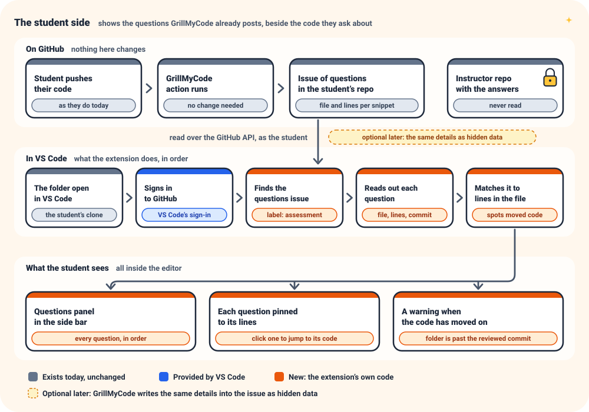
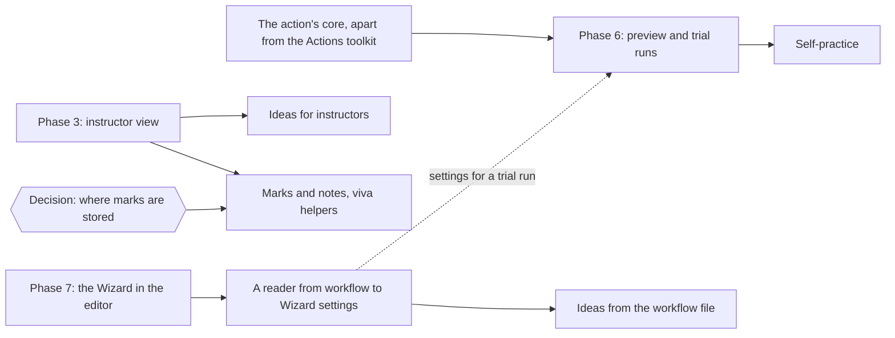
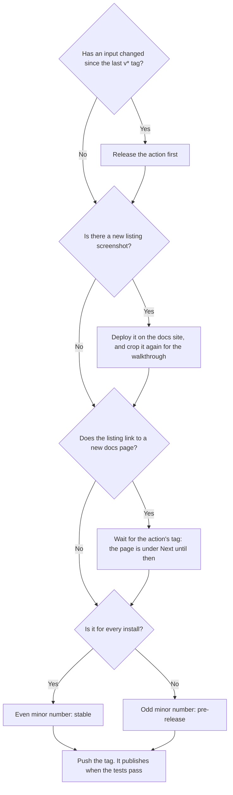
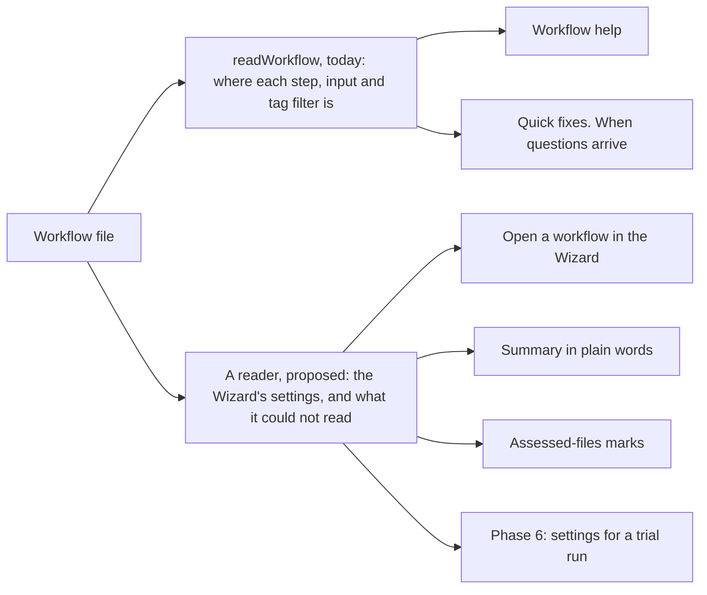

# VS Code extension — plan

> **Recorded:** 2026-10-03 (`ff56b1d`). Shortened on 2026-10-04 and 2026-10-10.
> The fuller wording is this file at `ee31e05`. What was tried and how is at
> `10791ec`.
> **Status:** 0.4.1 is the stable release, of 2026-10-10. Phases 1, 3, 4, 5
> and 7 are released, 2 is under way and 6 is a proposal. Parts of 3, 5 and 7
> went out without having been seen working.

GrillMyCode Companion (`GrillMyCode.grillmycode`) shows the questions the
action posts beside the code they ask about. It lives in `extensions/vscode/`
and releases on its own `vscode-v*` tags.

Elsewhere: commands and release steps in `extensions/README.md`, rules for
contributors in `AGENTS.md`, and how each feature works in the docs site's
`reference/vscode-extension.md`.

---

## Phases at a glance

| Phase | What it adds                                                                                                     | Needs first                                          | Status                                     |
| ----- | ---------------------------------------------------------------------------------------------------------------- | ---------------------------------------------------- | ------------------------------------------ |
| 1     | From a question to its code: the questions list, the selected question, the jump to code, the moved-code warning | Nothing                                              | Published                                  |
| 2     | Ready for a class: publishing, guides and a stable release, then questions pinned to lines and "studied" ticks   | Nothing                                              | In progress                                |
| 3     | Instructor view: answers beside the student's code, and the view switch                                          | Nothing                                              | Released in 0.4.0, without marks and notes |
| 4     | Action changes: hidden data in the issue, and the marker check                                                   | An action release                                    | Released: action v0.25.0, extension 0.2.1  |
| 5     | Workflow help: the action's inputs checked, offered and described in a workflow file                             | A look at what the GitHub Actions extension does     | Released in 0.4.0                          |
| 6     | Assessed-files preview and local trial runs                                                                      | The action's core extracted from the Actions toolkit | Not started                                |
| 7     | The docs site's Workflow Wizard in an editor tab, reading the open folder and writing the workflow file          | Nothing                                              | Released in 0.4.0, fixed in 0.4.1          |

Keep this table current when a phase starts, finishes or changes scope. What
each phase still lacks is under [What is left](#what-is-left). The suggested
order is 2, then 6.

---

## Done

| What            | Released          | In one line                                                                                                                                                                                              |
| --------------- | ----------------- | -------------------------------------------------------------------------------------------------------------------------------------------------------------------------------------------------------- |
| Phase 1         | 2026-10-03        | Sign-in, the questions list, the selected question, the jump to code, the moved-code warning                                                                                                             |
| Phase 2, so far | 0.2.0             | The publisher, the release workflow, the name, two guides and a reference page, both install routes tried, a message in Restricted Mode                                                                  |
| Phase 4         | 2026-10-04        | The issue carries a `gmc:questions` comment with a layout version. The action touches only issues it wrote. The extension reads both layouts, and asks for an update on a newer one                      |
| Walkthrough     | 0.2.2, 2026-10-04 | Outside the phases. A patch number, because 0.3.0 would have been a pre-release                                                                                                                          |
| Phase 3         | 0.3.0, 2026-10-04 | An account that can read the answer key sees each answer, and can switch to the student view                                                                                                             |
| Phase 5         | 0.3.1, 2026-10-09 | The GrillMyCode step's inputs are checked as they are typed, and the values of a fixed set offered                                                                                                       |
| Phase 7         | 0.4.0, 2026-10-10 | **Open Workflow Wizard**. The package went from about 100 KB to about 240 KB, most of it React, which every student's install downloads                                                                  |
| 0.4.0           | 2026-10-10        | The first stable release since 0.2.2. Phases 3, 5 and 7 went to every install with the [hand checks](#built-not-yet-seen-working) undone, to be looked at afterwards                                     |
| 0.4.1           | 2026-10-10        | **Use the open folder** did not finish on a large folder. Listings now leave out what Git ignores and are asked for 32 at a time: on this repository 77 folders and 460 files, down from 1,473 and 5,000 |
| 0.4.2           | Not yet tagged    | **Next Question** and **Previous Question**, which step through the list. Outside the phases, from [Further ideas](#further-ideas). Stable, and the first release to sign in with the Entra identity     |
| Tags kept apart |                   | `release.yml` runs on `v[0-9]*` and `branch-build.yml` ignores every tag, so a `vscode-v*` tag cannot release the action                                                                                 |

| Channel     | Versions                                                                         |
| ----------- | -------------------------------------------------------------------------------- |
| Stable      | 0.1.0 (by hand, despite its odd minor number), 0.2.0, 0.2.1, 0.2.2, 0.4.0, 0.4.1 |
| Pre-release | 0.1.1, 0.1.2, 0.3.0, 0.3.1                                                       |

---

## What is left

| Phase   | What                                                       | Kind    | Note                                                                                                                                                                                                      |
| ------- | ---------------------------------------------------------- | ------- | --------------------------------------------------------------------------------------------------------------------------------------------------------------------------------------------------------- |
| 2       | An install by hand on Windows, with a GitHub sign-in       | Check   | The tests never sign in. Look at the listing's page in the same sitting                                                                                                                                   |
| 2       | A pass as a student, in a codespace and in desktop VS Code | Check   | From a template repository that lists the extension, with a test account, by the student guide. Shows whether the walkthrough opens after each kind of install and after an update, with its steps ticked |
| 2       | The first release published with the Entra identity        | Check   | `vscode-v0.4.2`, built and not yet tagged. See [Accounts and secrets](#accounts-and-secrets)                                                                                                              |
| 2       | Questions pinned to lines, as read-only comment threads    | Feature | After real use of the moved-code warning: a note on the wrong lines misleads. Weigh "the code as it was" first                                                                                            |
| 2       | "Studied" ticks, stored locally                            | Feature |                                                                                                                                                                                                           |
| 2       | Refreshing when the window regains focus                   | Feature |                                                                                                                                                                                                           |
| 3       | Marks and notes per question                               | Feature | Waits on where they are stored                                                                                                                                                                            |
| 3       | A real viva                                                | Check   | Done when an instructor runs one from the student's repository without leaving the editor, and a student account there sees no sign of the instructor view                                                |
| 3, 5, 7 | The hand checks below                                      | Check   | Check 4 matters most                                                                                                                                                                                      |
| 6       | All of it                                                  |         | See [Phase 6](#phase-6-assessed-files-preview-and-local-trial-runs)                                                                                                                                       |

No trial with a class is planned. It was dropped on 2026-10-04.

### Built, not yet seen working

Every install has had these since 0.4.0. Tests cover each one.

| #   | Phase | What                                              | What nobody has seen                                                                                                                                                                                                                                       |
| --- | ----- | ------------------------------------------------- | ---------------------------------------------------------------------------------------------------------------------------------------------------------------------------------------------------------------------------------------------------------- |
| 1   | 4     | An issue from before `v0.25.0` updated in place   | On GitHub. The tests use a stand-in                                                                                                                                                                                                                        |
| 2   | 4     | The update message                                | An installed copy, which should offer **Update**. A development copy offers **Install**                                                                                                                                                                    |
| 3   |       | The "Run Extension" launch entry                  | Run at all                                                                                                                                                                                                                                                 |
| 4   | 3     | The instructor view against GitHub                | A sign-in, and a student's repository opened. Every student's copy asks GitHub about an answer key each time it loads, and only the tests have seen GitHub refuse. Also shows whether an instructor's account may list a repository's direct collaborators |
| 5   | 3     | The two switch buttons in the view's title bar    | The buttons, which show only under a pointer. Both commands were run by name                                                                                                                                                                               |
| 6   | 5     | Workflow help beside the GitHub Actions extension | The two together, signed in or not. The tests run without it                                                                                                                                                                                               |
| 7   | 5     | Workflow help by hand                             | Problems, completions and hover text appear as someone types                                                                                                                                                                                               |
| 8   | 7     | The Wizard's prompts                              | The folder dialog, the choice between open folders, the question before a file is replaced                                                                                                                                                                 |
| 9   | 7     | The Wizard with no folder open, or several        | With none, the workflow should open as an unsaved file. The tests run with one                                                                                                                                                                             |
| 10  | 7     | The Wizard on Windows and macOS                   | Its buttons pressed. On Linux a script worked all ten steps in a real tab, dark and light                                                                                                                                                                  |
| 11  | 7     | The Wizard on a large folder, since 0.4.1         | **Use the open folder** pressed. A large folder outside Git still has up to 5,000 files read                                                                                                                                                               |
| 12  |       | Next and previous, from 0.4.2                     | The two buttons in the title bar, and a step taken with the GrillMyCode view closed. Both commands were run by name                                                                                                                                        |

---

## Accounts and secrets

- **Publisher:** `GrillMyCode`. Verification of `grillmycode.org`, for the
  verified badge, was requested on 2026-10-03.
- **Approval:** the `vscode-marketplace` environment has no required reviewer,
  so a tag publishes as soon as the tests pass.

| Way to sign in             | State                                                                                                                                                                                         | Note                                                                                                                                                                                           |
| -------------------------- | --------------------------------------------------------------------------------------------------------------------------------------------------------------------------------------------- | ---------------------------------------------------------------------------------------------------------------------------------------------------------------------------------------------- |
| A Microsoft Entra identity | Set up on 2026-10-10: the publisher check passes. No release has published with it yet. Releases up to 0.4.1 signed in with a `VSCE_PAT` secret, deleted on 2026-10-10 with its token revoked | The workflow uses it whenever the environment names it. Needs a tenant that allows registering an application, and no Azure subscription                                                       |
| Trusted publishing         | Not open. On 2026-10-03 the Marketplace answered "Trusted Publishing is not supported", and the packaging tool (4.0.0) sent a request it rejects                                              | The publisher check reports the answer on every run. When it opens: raise `@vscode/vsce`, add a policy naming this repository and `vscode-extension-release.yml`, and delete the two variables |

Setting up the Entra identity, as done on 2026-10-10:

1. Register an application in the tenant. It needs no secret and no role.
2. Give it a federated credential for GitHub Actions. Entra compares the
   subject letter for letter, capitals included.
   - Issuer: `https://token.actions.githubusercontent.com`
   - Subject: `repo:NSCC-ITC-Assessment/GrillMyCode:environment:vscode-marketplace`
   - The portal's form writes the subject with IDs in it
     (`repo:NSCC-ITC-Assessment@278432436/GrillMyCode@1218117237:…`), and the
     sign-in then fails with `AADSTS700213`. This repository sends the subject
     above until it opts in to GitHub's immutable subjects. Enter it with
     **Edit (optional)**, beside the subject.
3. On the `vscode-marketplace` environment, set the variables
   `AZURE_CLIENT_ID` and `AZURE_TENANT_ID`. Neither is a secret.
4. Run **VS Code Extension Publisher Check**. It prints the ID the Marketplace
   knows the identity by, then fails, because the identity is not yet a member
   of the publisher.
5. On the publisher's page, add that ID as a member with the Contributor role.
6. Run the check again. It passes once the membership is in place.

Do steps 3 to 6 in one sitting, with no tag pushed in between.

---

## Rules that outlast the phases

| Rule                                                                        | Why, and what follows                                                                                                                                                                                          | Guarded by                             |
| --------------------------------------------------------------------------- | -------------------------------------------------------------------------------------------------------------------------------------------------------------------------------------------------------------- | -------------------------------------- |
| Even minor numbers are stable, odd ones pre-releases                        | Installs update on their own, so a stable release mid-term changes what every student sees. A number is published once: 0.4.1 fixes 0.4.0                                                                      |                                        |
| The report format, not the version number, ties the extension to the action | Workflows float on `@v0`, so a new layout reaches every repository at once while installs lag. The extension reads every layout a supported action has written                                                 | `test/extension-fixtures.test.js`      |
| The answer key's format is part of that contract                            | Each fixture carries its run's `questions.json`, and the extension keeps a copy of the action's rules for where that file is                                                                                   | `test/extension-fixtures.test.js`      |
| The input list is generated                                                 | By `scripts/build-extension-action-inputs.js`. Every check follows what `src/inputs.js` does with the value                                                                                                    | `test/extension-action-inputs.test.js` |
| An unknown input is a warning, never an error                               | The extension knows the inputs as they were at its release. The warning says to update                                                                                                                         |                                        |
| A release carries main's Wizard and main's inputs                           | Release the action first when an input has changed since the last `v*` tag. The docs site's Wizard can be newer than an installed one                                                                          |                                        |
| There is one Workflow Wizard                                                | Bundled from `docs-site/docs/_workflow-wizard/` where it stands, nothing copied. What only the editor can do comes through the optional `host`                                                                 | `test/extension-wizard.test.js`        |
| One page runs a script: the Wizard's                                        | The Selected Question view shows issue text, so it never does. The Wizard's page is sent nothing from an issue or an answer key, may reach one address, and gets files only from a folder the instructor chose |                                        |
| A student's copy shows no sign of the instructor view                       | The switch commands appear only once an answer key is read                                                                                                                                                     | `test/manifest.test.js`                |
| No dependence on VS Code's Git extension                                    | It is off in Restricted Mode                                                                                                                                                                                   | `test/manifest.test.js`                |
| One extension serves both sides                                             | Split it if the package slows student installs, or an API key in every student's tool becomes hard to justify. The code is in a folder per side, so a split is a packaging change                              |                                        |

Before a `vscode-v*` tag is pushed:

---

## Settled while building

| Phase | About                             | What was settled                                                                                                                                                             |
| ----- | --------------------------------- | ---------------------------------------------------------------------------------------------------------------------------------------------------------------------------- |
| 3     | Who the student is                | A direct collaborator, as the action finds them. In the account's own repository, the login. An account that may not list collaborators gets the student view                |
| 3     | A team repository                 | Nobody's own: an account that can read its answer key starts in the instructor view                                                                                          |
| 3     | Who gets the switch               | Any account that can read the answer key                                                                                                                                     |
| 3     | Distractors                       | Read and not shown: a spoken check has no use for them                                                                                                                       |
| 3     | Answer key and issue              | Compared by question number and lines. When they differ the view says so, and makes no moved-code claim                                                                      |
| 5     | The GitHub Actions extension      | Where it is installed, input names, descriptions and unknown inputs are left to it. It does not report a missing `api_key`, because `action.yml` gives that an empty default |
| 5     | Values, and checks between inputs | Built either way                                                                                                                                                             |
| 5     | Reading the file                  | With the `yaml` package, as GitHub's own parser does, so a value is read as the action receives it                                                                           |
| 5     | Not checked                       | A value GitHub works out at run time. Exclude patterns and stack templates, until phase 6 brings in `src/file-selection.js`                                                  |
| 5     | Students                          | They get it too, where the repository holds the workflow. One setting switches it off                                                                                        |
| 7     | Bundled, not rebuilt              | A Wizard made of VS Code's pickers would have to follow every change to the first                                                                                            |
| 7     | Colours                           | Each `--ifm-` variable is given the editor's value, so the Wizard's own stylesheet follows the theme                                                                         |
| 7     | Walking the folder                | The page asks the extension for a folder's entries, so the rules for what is skipped stay in the Wizard's `readFolder.js`                                                    |
| 7     | What is read                      | The folder as it is on disk, as on the docs site, less what Git ignores. A file neither tracked nor ignored is listed, though a run never sees it                            |
| 7     | Writing the file                  | As an edit, after asking, so it can be undone                                                                                                                                |
| 7     | Who has the command               | Everyone: the Wizard is public on the docs site. It is in the Command Palette alone, until instructor tools have somewhere to live                                           |
| 7     | The tab after a restart           | Not brought back. Its answers are lost when it closes                                                                                                                        |

---

## Phase 6: assessed-files preview and local trial runs

Marks each file as assessed, excluded or starter code, and runs the pipeline
against a sample repository to show the questions with token use and cost.

|                 |                                                                                                                                                                                                    |
| --------------- | -------------------------------------------------------------------------------------------------------------------------------------------------------------------------------------------------- |
| **Needs first** | The action's core apart from the Actions toolkit: eleven modules import `@actions/core` and need a logger and a settings object passed in. No behaviour changes, and it can be released on its own |
| **Also needs**  | VS Code's secret storage for the API key. The comment stripper (`rmcm`) built for Windows and macOS, or a run without stripping. Code that runs on VS Code's Node, not only Node 24                |
| **Left out**    | PDF generation                                                                                                                                                                                     |
| **Size**        | Large                                                                                                                                                                                              |
| **Done when**   | An instructor sees what a workflow would assess, and what a run would cost, without pushing                                                                                                        |

---

## Further ideas

None of these is planned. "Small" is days and "medium" a week or two.

### For students

| Idea                      | What it does                                                                    | Needs                                               | Size      |
| ------------------------- | ------------------------------------------------------------------------------- | --------------------------------------------------- | --------- |
| The code as it was        | Opens the file at the commit the questions were written about, read-only        | Nothing                                             | Small     |
| New-questions notice      | A badge and a notification when a newer set of questions arrives                | Nothing                                             | Small     |
| Run status                | Shows that the workflow is running after a push, then loads the questions       | Reading the repository's workflow runs              | Small     |
| Open from the issue       | A link on each question in the issue that opens it in VS Code                   | An action change, probably a redirect page          | Medium    |
| Other interface languages | The extension's own text in French and other languages                          | Translations                                        | Small     |
| Self-practice             | A student generates practice questions before pushing, on their own key or seat | The shared core from phase 6, and a way to reach AI | Not sized |

### For instructors

All build on phase 3.

| Idea                 | What it does                                                          | Needs                                  | Size   |
| -------------------- | --------------------------------------------------------------------- | -------------------------------------- | ------ |
| Class list           | Every student in the assignment, with who has questions yet           | Nothing more                           | Medium |
| Resubmission history | Earlier question sets and the log of runs, for submission tags        | Nothing more                           | Small  |
| Viva helpers         | A random pick, answers hidden until revealed, a timer, marks exported | The decision on where marks are stored | Medium |
| Starter-code markers | Shows which questions are about starter code alone                    | Nothing more                           | Small  |
| Flag a poor question | Records that a question was unclear or wrong, for tuning the prompt   | Somewhere to keep the flags            | Small  |
| Build the quiz       | Starts the instructor repository's quiz workflow from the editor      | Nothing more                           | Small  |
| Cost of each run     | Token use and cost per student and per assignment                     | The action to record them as data      | Medium |

### From the workflow file

The extension reads a workflow file today for where things are. Most of these
need it read for what it means.

| Idea                          | What it does                                                                                                                                                                  | Needs                                                                 | Size   |
| ----------------------------- | ----------------------------------------------------------------------------------------------------------------------------------------------------------------------------- | --------------------------------------------------------------------- | ------ |
| Open a workflow in the Wizard | Reads a workflow file back into the Wizard's steps, to change one setting without answering them all again                                                                    | The reader                                                            | Medium |
| Summary in plain words        | Says what a workflow does: what starts it, the model, how many questions and where they go                                                                                    | The reader                                                            | Small  |
| Assessed-files marks          | Marks each file in the Explorer as assessed, excluded or starter code. Phase 6's preview without the trial run                                                                | The reader, and the file selection rules outside the Wizard's page    | Medium |
| Checks on patterns            | Reports an exclude pattern or a stack template the action would not accept                                                                                                    | The file selection rules outside the Wizard's page                    | Small  |
| When questions arrive         | Tells a student with no questions yet what starts a run: every push, a tag such as `submit-1`, or the instructor. Run status would learn which workflow to watch the same way | Nothing                                                               | Small  |
| Setup checklist               | Checks that the secrets the workflow names exist, before the first run fails for want of one                                                                                  | An account allowed to list a repository's secrets: an administrator's | Small  |
| Quick fixes                   | Replaces a misspelled input with the one meant                                                                                                                                | Nothing                                                               | Small  |
| Upgrade a workflow            | Rewrites an input that a later version of the action renames or removes                                                                                                       | A record of what each version changed                                 | Small  |

To settle before building the reader:

| Question                      | Proposed answer                                                                                                                                                                                                                                                                   |
| ----------------------------- | --------------------------------------------------------------------------------------------------------------------------------------------------------------------------------------------------------------------------------------------------------------------------------- |
| What is lost on reading back? | Manual-run overrides, written as `${{ github.event.inputs.x \|\| 'default' }}`, and what a hand edit added: comments, other steps, values with no setting. Before saving, the workflow is written again from what was read and compared, and the instructor is told what would go |
| How is it tested?             | By going round: reading the YAML the Wizard writes gives the same answers back                                                                                                                                                                                                    |
| Where does it live?           | Beside `generateYaml.js`, so the docs site can read a pasted workflow too. The docs site lacks the `yaml` package. The root and the extension have it                                                                                                                             |
| Is a student's copy trusted?  | No. A student can edit it, so what is read there is shown and nothing more                                                                                                                                                                                                        |
| What is built first?          | The summary. It writes nothing, so it cannot harm a file while the reader is new                                                                                                                                                                                                  |

### Reach and upkeep

| Idea                     | What it does                                               | Needs                              | Size   |
| ------------------------ | ---------------------------------------------------------- | ---------------------------------- | ------ |
| Open VSX                 | Publishes to the registry Cursor, VSCodium and similar use | Its own token, and a release step  | Small  |
| The browser editor       | Works in github.dev, where there is no local Git           | Another way to read Git state      | Medium |
| GitHub Enterprise Server | Works for schools that host GitHub themselves              | A setting for the server's address | Medium |
| A JetBrains plugin       | The same student side, in `extensions/jetbrains/`          | Nothing more: phase 4 is released  | Large  |

### Set aside

| Idea                                                                     | Why                                                                            |
| ------------------------------------------------------------------------ | ------------------------------------------------------------------------------ |
| An AI helper that answers the questions                                  | They are study prompts, and an answer on demand removes the reason to study    |
| Recording how code was written, to target pasted or AI-inserted code     | It is surveillance of students                                                 |
| Re-matching questions after the code is edited                           | Comments are stripped by default, so the snippet often does not match the file |
| Writing answers in the editor                                            | Where they are kept and who sees them is a product decision                    |
| Reading the repository without Git, so questions show in Restricted Mode | Each piece of Git state would need its own reader                              |

---

## Open decisions

| Decision                                                         | What is known                                                                                             |
| ---------------------------------------------------------------- | --------------------------------------------------------------------------------------------------------- |
| Who approves a publish                                           | Today a pushed tag publishes on its own                                                                   |
| Which tenant holds the Entra identity                            | The college's, if it allows registering an application, or another                                        |
| Whether students may be asked for the `repo` permission          | There is no narrower one for private repositories                                                         |
| A release freeze during term                                     | For stable versions                                                                                       |
| Where viva marks and notes are stored                            | Locally, or committed to the instructor repository. And what a mark is: levels, a number, or a note alone |
| How the extension tells that an account administers a repository | Which permission Classroom 50 gives each role has not been checked                                        |
| Whether self-practice is wanted at all                           | The questions would differ from the instructor's                                                          |
